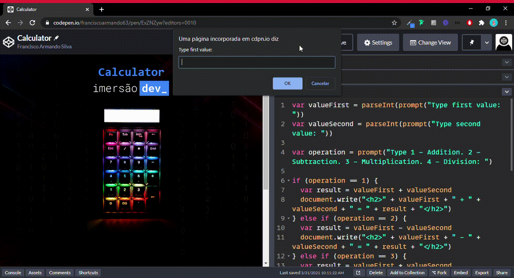

<h1
  align="center"
>
  
</h1>

<h3
  align="center"
>
  Dev Immersion is an immersion of Alura for Beginners in Programming and for those who wish to review the initial concepts.
</h3>

 
 

<h2
  align="center"
>
  CLASS TWO - Calculator and Conditional Loops in JavaScript
</h2>

 
<h1
  align="center"
>
  
</h1>

### Access my code at CodePen by clicking [here](https://codepen.io/franciscoarmando63/pen/ExZNZyw?editors=0010)

 

### In this program, we will learn what are if and else conditional loops, how to compare one value with another to execute code or not. In addition, we will learn how to write on the screen with the document.write function

 

<strong>
  CHALLENGES OF THE CLASS
</strong>

 

* Display a pokemon on the screen and ask the user to write the name of that pokemon. Display whether you got the name right or wrong.
